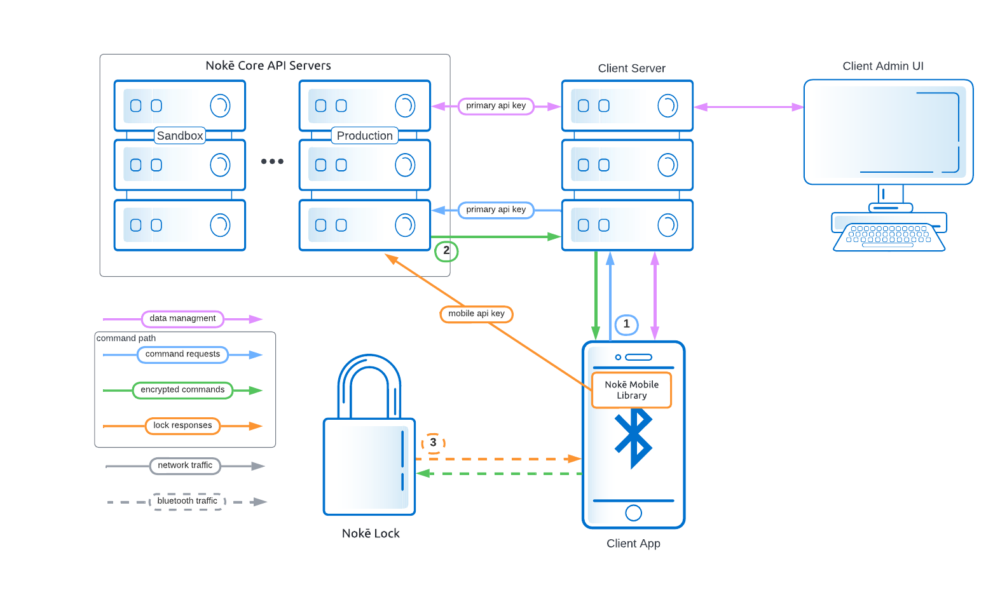

# Nokē Core API Documentation

## Overview

The Nokē Core API is a quick and simple way to integrate Nokē products with your existing software systems. This documentation covers the initial closed beta release. 

If you've looked at the Nokē Mobile Library documentation (*[Android]((https://github.com/noke-inc/noke-mobile-library-android#nok%C4%93-mobile-library-for-android)) / [iOS](https://github.com/noke-inc/noke-mobile-library-ios#nok%C4%93-mobile-library-for-ios)*) you may recognize the structure of the following diagram, but you'll also see some differences. This diagram represents a client with a server (which is the most common setup). It also includes more detail. 



The diagram shows four different types of data flow:
* data management (pink)
  * This includes client side functionality as well as most CoreAPI features such as issuing, revoking and displaying offline keys, fob, and quick click codes. It also represents listing locks and activity.
* command requests (blue)
  * This path includes all requests that return commands for directly interacting with a lock or fob: /unlock, /unshackle, /fob/sync, and /fwupdate. 
* encrypted commands (green)
  * This represents the responses to command requests. The result may include one or more commands that should be passed straight on to the lock or fob. 
* lock responses (orange)
  * This is the path by which a lock responds to commands. The response will include information for the client app to consume as well as information that the Nokē Mobile Library will pass straight to the Core API server.

As you can see there are three phases to the command process. If there are failures in any of these phases, the full command process fails. In particular, the third phase (lock responses), are critical to maintaining lock state, but failures in this phase are easier to miss.

The offline keys process straddles the two main pathways (data management, command path). The API calls for this feature are mostly for managing keys in the Core API database, but it does also return encrypted commands for sending to a lock. The difference here is that these commands won't be sent straight to the lock, but should be saved to send to the lock at a later time (for example, when there is no network connection for the primary command path).

Please note that there are multiple Core API servers. Each one has a unique URL and set of API keys. It is the client's responsibility to make sure that the client app (via Nokē Mobile Library) and client server both connect to the same server and use the respective API keys. The Mode (SANDBOX/PRODUCTION) determines the URL used by the Nokē Mobile Library. The mobile API key must also be set in the Nokē Mobile Library in order for lock responses to the reach the Core API server. 

The private API key and corresponding Core API URL should be used for all API requests made directly by the client.


[back to top](#overview) / [TOC](#api)
<br/>
<br/>

## Integration

New clients usually start integration with the sandbox server. You will receive a pair of API keys for that server and you should use the sandbox server during development. The sandbox server runs against a separate database from production. It also does not modify lock keys in order to protect the locks during development. Lock keys are generally unique and specific to each lock, but on sandbox they are generally all set to the default.

We advise starting by setting the mode and mobile API key for the Nokē Mobile Library then proceeding with API call implementations with the /unlock call first. The /unlock call is also responsible for syncing any changes to the locks. In other words, if your were to implement quick click codes, but hadn't already implemented the /unlock call you would not be able to test your new quick click codes on an actual lock since they won't sync to the lock without the /unlock call.

Once the client is satisfied with their integration with Core API we will help them migrate to the production server. This entails a few steps:
* We create and send a new pair of API keys for the client to use on the production server. 
* We will also send you the URL for the production server though it is listed below.
* You will need to:
  * change the Nokē Mobile Library Mode to PRODUCTION
  * set the new mobile API key for Nokē Mobile Library to use
  * change the private API key and URL for all other communication with Core API
  * send us a list of any locks you wish to move from sandbox over to production
    * you may also include other locks that need to be added to production but aren't already on sandbox
    * in general, if you wish to move locks from Nokē Pro or other product to Core API production, please specify where it is coming from so that we can retrieve the proper keys for that lock.
* We transfer the specified locks to the production database

We suggest you keep using sandbox for future client-side development and testing. For this reason it is good to keep at least one lock in the sandbox environment. It is not advisable to move locks back and forth between Nokē products since the various databases are not guaranteed to have the correct lock keys. We can move them manually, but it isn't a convenient process and is currently somewhat error prone as most human processes are. 

### Pre-Release Servers

From time to time we update Core API either to fix bugs or add new features. When this happens we will roll out those changes to a pair of pre-release servers (one for sandbox and one for production) before rolling the changes out to the main servers. This allows clients the opportunity to test their code against the Core API changes to make sure we haven't broken something you depend on. After some period of time we then move the changes to the main servers.

It is **important** to know that these two servers DO NOT run against isolated databases. The sandbox pre-release runs against the same database as sandbox. Same for production. This allows you to use your current database for testing, but also means that any changes made in pre-release will also be made to the corresponding live database.

Also be aware that the pre-release servers may be updated at any time. Most of the time they will have the same code as the main servers, but DO NOT depend on this. 

Finally, while the Nokē Mobile Library has the sandbox and production URLs built in (selected via Mode), it does not have the pre-release URLs built in. It is, therefore, necessary to set the URL specifically when using pre-release servers. *(As of 2022-08-22 the mobile libraries don't support this, but should soon)*.

### Server Values 
| Use | Server | URL (client set) | Mode (client set) | Keys (client set) | Database |
| --- | -------| --- | ---- | ---- | -------- |
| client development | sandbox | https://coreapi-sandbox.appspot.com/ | SANDBOX | sandbox keys | core-api-sandbox |
| live use | production | https://coreapi-beta.appspot.com/ | PRODUCTION | production keys | core-api |
| beta testing w/client development | sandbox pre-release | https://pre-release-dot-coreapi-sandbox.appspot.com/ | SANDBOX | sandbox keys | core-api-sandbox |
| beta testing w/production | production pre-release | https://pre-release-dot-coreapi-beta.appspot.com/ | PRODUCTION | production keys | core-api |


[back to top](#overview)
<br/>
<br/>

## API

* [Locks](#locks)
  * [POST /lock/](#post-lock)
  * [POST /unlock/](#post-unlock)*
  * [POST /unshackle/](#post-unshackle)
  * [POST /engagelock/](#post-engagelock)
  * [POST /lock/settings/](#post-locksettings)
  * [POST /keys/](#post-keys)
  * [Quick Clicks](#quick-clicks)
    * [POST /qc/issue/](#post-qcissue)
    * [POST /qc/revoke/](#post-qcrevoke)
    * [POST /qc/display/](#post-qcdisplay)
    * [POST /qc/](#post-qc)
* [Fobs](#fobs)
  * [POST /fobs/issue](#post-fobsissue)
  * [POST /fobs/revoke](#post-fobsrevoke)
  * [POST /fobs/display](#post-fobsdisplay)
  * [POST /fobs/sync](#post-fobssync)
* [Activity](#activity)
  * [POST /upload/](#post-upload)*
  * [POST /activity](#post-activity)
* [API Versions](#api-versions)
* [Firmware Update](#firmware-update-mode)
  * [POST /fwupdate/](#post-fwupdate)

 \* Before testing any code against actual locks, make sure that your mobile api key is set in the Nokē Mobile library. Also, make sure to implement the unlock call first as it also handles lock setup. If these two steps aren't done in the order specified there is the potential for losing lock keys which can result in bricked locks.

<br/>

## Locks
### POST /lock/
Used to view information about locks. Supports finding a single lock, multiple locks, or all locks associated with a company. Also supports finding locks by serial number or by both mac or serial number. At least one array must be present but both maybe included. Locks that fit either array will be returned.


#### HEADERS


|Key|Value|
|--|--|
|Content-Type | application/json  |
|Authorization | Bearer *api_key* |


#### BODY

|Parameter|Description|
|--|--|
|***macs*** | An array of mac addresses from the lock(s) _optional_|
|***serials*** | An array of serial numbers for the lock(s) _optional_|


##### Single Lock

```json
{
    "macs": [
		"XX:XX:XX:XX:XX"
	]
}
```
##### Multiple Locks

```json
{ 
    "macs": [
        "XX:XX:XX:XX:XX", 
        "XX:XX:XX:XX:XY"
	]
}
```
##### All Locks

```json
{ 
	//empty body
}
```

#### EXAMPLE RESPONSE

```json
{
    "result": "success",
    "message": "Command successfully completed",
    "error_code": 0,
    "data": {
        "locks": [
            {
                "mac": "XX:XX:XX:XX:XX:XX",
                "created_by": "J Doe",
                "created_date": "2018-04-04T16:00:00Z",
                "setup_count": 0,
                "hw_version": "3p",
                "fw_version": "2.10",
                "serial": "XXX-XXX-XXXX",
                "internal_battery": 0,
                "external_battery": 0,
                "status": "ready",
                "flags": "none",
                "settings": {
                    "explicit-lock":true,
                }
            }
        ]
    },
    "request": "lock",
    "api_version": { ... }
}
```

|Parameter|Description|
|--|--|
|***result*** | String value representing the result of the call. Either **<span style="color:skyblue">success</span>** or **<span style="color:skyblue">failure</span>**|
|***message*** | Readable description of the error|
|***error_code*** | Int value of the error thrown|
|***locks*** | Array of locks contain information about all the requested locks|
|***<span style="white-space:pre" >  -   mac</span>*** | Mac address of the lock|
|***<span style="white-space:pre" >  -   created_by</span>*** | Name of the user who registered the lock to the company|
|***<span style="white-space:pre" >  -   created_date</span>*** | Date that the lock was registered to the company|
|***<span style="white-space:pre" >  -   setup_count</span>*** | Number of times the lock has been set up. Used for tracking logs|
|***<span style="white-space:pre" >  -   hw_version</span>*** | Hardware version of the lock|
|***<span style="white-space:pre" >  -   fw_version</span>*** | Current firmware version of the lock|
|***<span style="white-space:pre" >  -   serial</span>*** | Serial number of the lock.  This can also be found laser-etched onto the lock|
|***<span style="white-space:pre" >  -   internal_battery</span>*** | Value of the internal battery of the lock in millivolts|
|***<span style="white-space:pre" >  -   external_battery</span>*** | Value of the external battery of the lock in millivolts|
|***<span style="white-space:pre" >  -   status</span>*** | Status of the lock. Indicates if the lock is ready to be used or awaiting setup|
|***<span style="white-space:pre" >  -   flags</span>*** | An array of flags that indicate if any data needs to be synced to the lock (ie: quick-clicks, keys, etc). Syncing is handled automatically on the unlock endpoint|
|***<span style="white-space:pre" >  -   settings</span>*** | Map of lock settings and their values (JSON) |
|***request*** | Name of the request|
|***api_version*** | Current information about API versions ([see section on API versions](#api-versions))|

[back to top](#overview) / [TOC](#api)
<br/>
<br/>

---
### ***POST /unlock/```

Used to unlock a lock. Requires a session string from the lock (*see Nokē Mobile library documentation [Android]((https://github.com/noke-inc/noke-mobile-library-android#nok%C4%93-mobile-library-for-android)) / [iOS](https://github.com/noke-inc/noke-mobile-library-ios#nok%C4%93-mobile-library-for-ios)*), a mac address, and can optionally take a tracking key to associate to lock activity. 

#### HEADERS

|  Key | Value  |
|--|--|
|Content-Type | application/json  |
|Authorization | Bearer *api_key* |

#### BODY

|Parameter|Description|
|--|--|
|***mac*** | The mac address of the lock|
|***session```| Unique session generated by the lock and read by the phone when connecting. (*see Nokē Mobile library documentation [Android]((https://github.com/noke-inc/noke-mobile-library-android#nok%C4%93-mobile-library-for-android)) / [iOS](https://github.com/noke-inc/noke-mobile-library-ios#nok%C4%93-mobile-library-for-ios)*)|
|***tracking_key*** | An optional string used to associate to lock activity|

```json
{
    "mac": "XX:XX:XX:XX:XX:XX",
    "session": "0000040ba7b0d91f7f45ad25698a18375c7e4f16",
    "tracking_key": "bob@gmail.com"
}
```
#### EXAMPLE RESPONSE

```json
{
    "result": "success",
    "message": "Command successfully completed",
    "error_code": 0,
    "data": {
        "commands": "COMMAND_STRING_HERE"
    },
    "token": "TOKEN_HERE",
    "request": "unlock",
    "api_version": { ... }
}
```

|Parameter|Description|
|--|--|
|***result*** | String value representing the result of the call. Either ```success``` or ```failure```|
|***message*** | Readable description of the error|
|***error_code*** | Int value of the error thrown|
|***commands*** | A string of commands sent to the lock by the (*Nokē Mobile library documentation [Android]((https://github.com/noke-inc/noke-mobile-library-android#nok%C4%93-mobile-library-for-android)) / [iOS](https://github.com/noke-inc/noke-mobile-library-ios#nok%C4%93-mobile-library-for-ios)*)|
|***request*** | Name of the request|
|***api_version*** | Current information about API versions ([see section on API versions](#api-versions))|

[back to top](#overview) / [TOC](#api)
<br/>
<br/>

---
### ```POST /unshackle/```

Used to remove the shackle from an HD padlock. Operates identically to the ```/unlock/``` endpoint.  Please see [above](#post-unlock) for more details. 

[back to top](#overview)
<br/>
<br/>

---
### ```POST /engagelock/```

Used to explicitly engage a lock. By default locks automatically engage after being unlocked (following a timeout period). HD locks with firmware 4.25 or higher support a setting that turns this off. In this case, the client is responsible for engaging the lock. This endpoint returns the command necessary to instruct the lock to engage. Requires a session string from the lock (*see Nokē Mobile library documentation [Android]((https://github.com/noke-inc/noke-mobile-library-android#nok%C4%93-mobile-library-for-android)) / [iOS](https://github.com/noke-inc/noke-mobile-library-ios#nok%C4%93-mobile-library-for-ios)*), a mac address, and can optionally take a tracking key to associate to lock activity. 

#### HEADERS

|  Key | Value  |
|--|--|
|Content-Type | application/json  |
|Authorization | Bearer *api_key* |

#### BODY

|Parameter|Description|
|--|--|
|***mac*** | The mac address of the lock|
|***session*** | Unique session generated by the lock and read by the phone when connecting. (*see Nokē Mobile library documentation [Android]((https://github.com/noke-inc/noke-mobile-library-android#nok%C4%93-mobile-library-for-android)) / [iOS](https://github.com/noke-inc/noke-mobile-library-ios#nok%C4%93-mobile-library-for-ios)*)|
|***tracking_key*** | An optional string used to associate to lock activity|

```json
{
    "mac": "XX:XX:XX:XX:XX:XX",
    "session": "0000040ba7b0d91f7f45ad25698a18375c7e4f16",
    "tracking_key": "bob@gmail.com"
}
```
#### EXAMPLE RESPONSE

```json
{
    "result": "success",
    "message": "Command successfully completed",
    "error_code": 0,
    "data": {
        "commands": "COMMAND_STRING_HERE"
    },
    "token": "TOKEN_HERE",
    "request": "unlock",
    "api_version": { ... }
}
```

|Parameter|Description|
|--|--|
|***result*** | String value representing the result of the call. Either ```success``` or ```failure```|
|***message*** | Readable description of the error|
|***error_code*** | Int value of the error thrown|
|***commands*** | A string of commands sent to the lock by the (*Nokē Mobile library documentation [Android]((https://github.com/noke-inc/noke-mobile-library-android#nok%C4%93-mobile-library-for-android)) / [iOS](https://github.com/noke-inc/noke-mobile-library-ios#nok%C4%93-mobile-library-for-ios)*)|
|***request*** | Name of the request|
|***api_version*** | Current information about API versions ([see section on API versions](#api-versions))|

[back to top](#overview) / [TOC](#api)
<br/>
<br/>

---
#### ```POST /lock/settings/```

Used to set lock settings. Not all locks will support or accept each setting. See below for possible settings.

##### HEADERS

| Key           | Value            |
| ------------- | ---------------- |
| Content-Type  | application/json |
| Authorization | Bearer *api_key* |

##### BODY

|Parameter|Description|Type/Opts| Default
|--|--|--|--|
|***settings*** | A map of settings (keyed by setting name; currently only 'explicit-lock')||
|***<span style="white-space:pre" >  -   explicit-lock</span>*** | If true, lock will stay unlocked until given an 'engage lock' command. Otherwise, lock engages after timeout (this is the default).|true, false|false
|***macs*** | An array of mac addresses from the lock(s) to display|

```json
{
    "settings":{
        "explicit-lock": true
    },
	"macs": [
        "YY:YY:YY:YY:YY:YY",
        "XX:XX:XX:XX:XX:XX"
	]
}
```

##### EXAMPLE RESPONSE

```json
{
    "result": "success",
    "message": "Command successfully completed",
    "error_code": 0,
    "error_details": null,
    "data":  [
        {
            "mac": "YY:YY:YY:YY:YY",
            "quick_clicks": [
                {
                    "code": "101",
                    "pending": true,
                    "revoked": false,
                    "uses": 255,
                    "start_uses": 255
                },
                {
                    "code": "010",
                    "pending": true,
                    "revoked": false,
                    "uses": 10,
                    "start_uses": 15
                }
            ]
        },
        {
            "mac": "XX:XX:XX:XX:XX",
            "quick_clicks": [
                {
                    "code": "101",
                    "pending": false,
                    "revoked": true,
                    "uses": 255,
                    "start_uses": 255
                }
            ]
        }
    ],
    "request": "qc/display",
    "api_version": { ... }
}
```

The response parameters are the same as for [/qc/issue/](#post-qc-issue), but the error_details field will likely always be null for a display request since it either succeeds or fails all together.

[back to top](#overview) / [TOC](#api)

<br/>
<br/>

---
### ```POST /keys/```

Used to request offline keys for a lock or locks, invalidate any existing keys, or view the status of any offline keys.  These offline keys can be used by the mobile libraries to unlock the lock without an active network connection (*see Nokē Mobile library documentation [Android]((https://github.com/noke-inc/noke-mobile-library-android#nok%C4%93-mobile-library-for-android)) / [iOS](https://github.com/noke-inc/noke-mobile-library-ios#nok%C4%93-mobile-library-for-ios)*).

#### Issue Keys

#### HEADERS

|  Key | Value  |
|--|--|
|Content-Type | application/json  |
|Authorization | Bearer *api_key* |

#### BODY

|Parameter|Description|
|--|--|
|***macs*** | The mac address(es) of the lock(s)|
|***tracking_keys*** | Identifying string used to track activity and revoke keys|

```json
{
    "issue": [
    	{
            "macs": ["XX:XX","YY:YY","ZZ:ZZ"],
            "tracking_keys": ["bob","linda"]
    	}
    ]
}
```
#### EXAMPLE RESPONSE

```json
{
    "data": {
        "locks": [
            {
                "mac": "XX:XX",
                "keys": [
                	{
                        "tracking_key": "bob",
                        "offline_key": "abc",
                        "unlock_command": "123"
                	},
                	{
                        "tracking_key": "linda",
                        "offline_key": "def",
                        "unlock_command": "456"
                	}
                ]
            },
           {
                "mac": "YY:YY",
                "keys": [
                	{
                        "tracking_key": "bob",
                        "offline_key": "ghi",
                        "unlock_command": "789"
                	},
                	{
                        "tracking_key": "linda",
                        "offline_key": "jkl",
                        "unlock_command": "A00"
                	}
                ]
            },
             {
                "mac": "ZZ:ZZ",
                "keys": [
                	{
                        "tracking_key": "bob",
                        "offline_key": "ghi",
                        "unlock_command": "789"
                	},
                	{
                        "tracking_key": "linda",
                        "offline_key": "jkl",
                        "unlock_command": "A00"
                	}
                ]
            }
        ]
    },
    "api_version": { ... }
}
```

|Parameter|Description|
|--|--|
|***mac*** | Mac address of the lock.|
|***tracking_key*** | String used to track activity associated with the key|
|***offline_key*** | Key used by the mobile library to encrypt the unlock command|
|***unlock_command*** | Command sent by the mobile library to the lock to unlock the lock|
|***error_code*** | Int value of the error thrown|
|***request*** | Name of the request|
|***api_version*** | Current information about API versions ([see section on API versions](#api-versions))|

#### View All Issued Keys

##### HEADERS

|  Key | Value  |
|--|--|
|Content-Type | application/json  |
|Authorization | Bearer *api_key* |

#### BODY

|Parameter|Description|
|--|--|
|***macs*** | The mac address(es) of the lock(s)|
|***tracking_keys*** | Identifying string used to track activity and revoke keys|

Input (empty)

```json
{}
```

Input (limit by mac)

```json
{
    "display": {
        "macs": ["XX:XX"]
    }
}
```

Input (limit by tracking key)

```json
{
    "display": {
        "tracking_keys": ["bob"]
    }
}
```


#### EXAMPLE RESPONSE

```json
{
    "data": {
        "locks": [
            {
                "mac": "XX:XX",
                "keys": [
                	{
                        "tracking_key": "bob",
                        "offline_key": "abc",
                        "unlock_command": "123"
                	},
                	{
                        "tracking_key": "linda",
                        "offline_key": "def",
                        "unlock_command": "456"
                	}
                ]
            },
           {
                "mac": "YY:YY",
                "keys": [
                	{
                        "tracking_key": "bob",
                        "offline_key": "ghi",
                        "unlock_command": "789"
                	},
                	{
                        "tracking_key": "linda",
                        "offline_key": "jkl",
                        "unlock_command": "A00"
                	}
                ]
            },
             {
                "mac": "ZZ:ZZ",
                "keys": [
                	{
                        "tracking_key": "bob",
                        "offline_key": "ghi",
                        "unlock_command": "789"
                	},
                	{
                        "tracking_key": "linda",
                        "offline_key": "jkl",
                        "unlock_command": "A00"
                	}
                ]
            }
        ]
    },
    "api_version": { ... }
}
```

|Parameter|Description|
|--|--|
|***mac*** | Mac address of the lock.|
|***tracking_key*** | String used to track activity associated with the key|
|***offline_key*** | Key used by the mobile library to encrypt the unlock command|
|***unlock_command*** | Command sent by the mobile library to the lock to unlock the lock|
|***error_code*** | Int value of the error thrown|
|***request*** | Name of the request|
|***api_version*** | Current information about API versions ([see section on API versions](#api-versions))|

#### Revoke Keys

When revoking keys please be aware that the revoked offline keys will still work on the lock until the lock is synced with the server during an online unlock event. In other words, if you are revoking an offline key to keep someone with that offline key from opening the lock it would be wise to go to the physical lock and run an online unlock (via your app on an internet connected device) immediately after revoking the key. Additionally, if keys are reset on a lock the offline keys stored on a users device will no longer work on that lock, even if the user still has access to the lock in your database, until the offline keys on their device are re-synced.

##### HEADERS

|  Key | Value  |
|--|--|
|Content-Type | application/json  |
|Authorization | Bearer *api_key* |

#### BODY

|Parameter|Description|
|--|--|
|***macs*** | The mac address(es) of the lock(s)|
|***tracking_keys*** | Identifying string used to track activity and revoke keys|

Input (revoke specific)

```json
{
    "revoke": [
        {"tracking_keys": ["bob"], "macs": ["XX:XX"]}
    ]
}
```

Input (revoke all keys for mac/macs)

```json
{
    "revoke": [
        {
            "macs": ["YY:YY"]
        }
    ]
}
```

Input (revoke all keys for tracking key/keys)

```json
{
    "revoke": [
    	{
        	"tracking_keys": ["bob"]
    	}
    ]
}
```


#### EXAMPLE RESPONSE

```json
{
    "data": {
        "locks": [
            {
                "mac": "XX:XX",
                "keys": [
                	{
                        "tracking_key": "linda",
                        "offline_key": "def",
                        "unlock_command": "456"
                	}
                ]
            },
           {
                "mac": "YY:YY",
                "keys": [
                	{
                        "tracking_key": "steve",
                        "offline_key": "jkl",
                        "unlock_command": "A00"
                	}
                ]
            }
        ]
    },
    "api_version": { ... }
}
```

|Parameter|Description|
|--|--|
|***mac*** | Mac address of the lock.|
|***tracking_key*** | String used to track activity associated with the key|
|***offline_key*** | Key used by the mobile library to encrypt the unlock command|
|***unlock_command*** | Command sent by the mobile library to the lock to unlock the lock|
|***error_code*** | Int value of the error thrown|
|***request*** | Name of the request|
|***api_version*** | Current information about API versions ([see section on API versions](#api-versions))|

[back to top](#overview) / [TOC](#api)
<br/>
<br/>

---
### ```Quick Clicks```

Used to issue quick clicks for a lock or locks, revoke existing quick clicks, or view the status of any active quick clicks.  Quick clicks can be used to unlock the lock without additional hardware. 

#### Overview

A quick click is a code that allows entry to a lock via a series of long and short presses. This allows access to a lock without the use of additional software / hardware outside the lock once a quick click has been synced with a lock.

Quick click codes are represented as a string of 1's and 0's representing long and short presses respectively. The exact mechanism of how the quick click is used is dependent on the lock. For example, the standard padlocks use the shackle to enter quick clicks, while the HD padlocks and the U-Lock use a push button at the base of the lock. Typically, when entering a quick click, an LED on the lock will light up for a short press, and the LED will change color on a long press.

Quick clicks may be unlimited use, or may have a limited use count which is rendered unusable once the quick click is used a given number of times.

Quick clicks are created and removed via the API and are synced with a lock when an online unlock is requested. 

**IMPORTANT**:

* Each quick click MUST be a unique code. Quick click codes can only be reused once they have been removed from a lock.
* Quick clicks are only added to / removed from a lock via an *online* unlock.
* Each lock can hold up to 100 quick click codes.
* Quick click codes must be between 3 to 24 characters
* Quick click's can have a limited use count between 1-254 uses OR may be unlimited use represented by a use count of 255

#### ```POST /qc/issue/```

Used to issue quick clicks for a lock. This can either be to issue a new code or to update the number of times an existing code can be used.

##### HEADERS

| Key           | Value            |
| ------------- | ---------------- |
| Content-Type  | application/json |
| Authorization | Bearer *api_key* |

##### BODY

|Parameter|Description|
|--|--|
|***mac*** | A mac address from a lock|
|***quick_clicks*** | An array of quick clicks to create or update|
|***<span style="white-space:pre" >  -   code</span>*** | A series of 1's and 0's representing the quick click code. Must be at least 3 characters long and no more than 24.|
|***<span style="white-space:pre" >  -   uses</span>*** | The number of times the code can be used. Any number 1-255 where 255 is a special case and represents unlimited uses.|

###### EXAMPLE REQUEST

```json
{
    "mac": "XX:XX:XX:XX:XX",
    "quick_clicks":[
        {	
            "code": "10100",
            "uses": 255
        },
        {
            "code": "010",
            "uses": 10
        }
    ]
}
```
##### EXAMPLE RESPONSES

Success
```json
{
   "result": "success",
   "message": "Command successfully completed",
   "error_code": 0,
   "error_details": null,
   "data": [
      {
         "mac": "E7:29:0E:6F:79:BB",
         "quick_clicks": [
            {
               "code": "00000",
               "pending": true,
               "uses": 1,
               "start_uses": 1
            }
         ]
      }
   ],
   "request": "qc/issue",
   "api_version": { ... }
}
```
Mixed Success and Failure (version >= 1.0.0)
```json
{
   "result": "success",
   "message": "Command successfully completed",
   "error_code": 0,
   "error_details": [
      {
         "mac": "E7:29:0E:6F:79:BB",
         "code": "10001",
         "msg": "use count can't be greater than 255",
         "action": "issue"
      }
   ],
   "data": [
      {
         "mac": "E7:29:0E:6F:79:BB",
         "quick_clicks": [
            {
               "code": "00000",
               "pending": true,
               "uses": 30,
               "start_uses": 30
            }
         ]
      }
   ],
   "request": "qc/issue",
   "api_version": { ... }
}
```

|Parameter|Description|
|--|--|
|***result*** | String value representing the result of the call. Either **success** or **failure**|
|***message*** | Readable description of the error|
|***error_code*** | Int value of the error thrown|
|***error_details*** | A list of errors encountered. This is particularly useful if multiple quick clicks are issued and some fail while others succeed. *Field added in version 0.1.0, but not used till 1.0.0*|
|***<span style="white-space:pre" >  -   mac</span>***| The mac address of the lock with an error|
|***<span style="white-space:pre" >  -   code</span>***| The quick click code that failed|
|***<span style="white-space:pre" >  -   msg</span>***| The failure message|
|***<span style="white-space:pre" >  -   action</span>***| The attempted action that resulted in the error (issue, revoke, etc)|
|***data*** | A list of successful quick click creations/updates. *Added in version 0.1.0*|
|***<span style="white-space:pre" >  -   mac</span>***| The mac address of the lock with a success|
|***<span style="white-space:pre" >  -   quick_clicks</span>***| A List of successful quick clicks|
|***<span style="white-space:pre" >  -   -   code</span>***| The quick click code|
|***<span style="white-space:pre" >  -   -   pending</span>***| The code's pending state (if applicable)|
|***<span style="white-space:pre" >  -   -   revoked</span>***| The code's revocation state (if applicable)|
|***<span style="white-space:pre" >  -   -   uses</span>***| Number of times remaining that the code may be used|
|***<span style="white-space:pre" >  -   -   start_uses</span>***| Total number of times the code was set to be used|
|***request*** | Name of the request|
|***api_version*** | Current information about API versions ([see section on API versions](#api-versions))|

[back to top](#overview) / [TOC](#api)

<br/>
<br/>

---
#### ```POST /qc/revoke/```

Used to revoke quick clicks from a lock. This is request is very similar to an issue request, just the uses field is not required. The response is identical.

##### HEADERS

| Key           | Value            |
| ------------- | ---------------- |
| Content-Type  | application/json |
| Authorization | Bearer *api_key* |

##### BODY

|Parameter|Description|
|--|--|
|***mac*** | A mac address from a lock|
|***quick_clicks*** | An array of quick clicks to revoke (identified by the code)|
|***<span style="white-space:pre" >  -   code</span>*** | A series of 1's and 0's representing the quick click code|

[back to top](#overview) / [TOC](#api)

<br/>
<br/>

---
#### ```POST /qc/display/```

Used to view information about the quick clicks for the given locks. If no macs are included in the request ALL quick clicks for ALL locks will be returned.

##### HEADERS

| Key           | Value            |
| ------------- | ---------------- |
| Content-Type  | application/json |
| Authorization | Bearer *api_key* |

##### BODY

|Parameter|Description|
|--|--|
|***macs*** | An array of mac addresses from the lock(s) to display|

```json
{
	"macs": [
        "YY:YY:YY:YY:YY:YY",
        "XX:XX:XX:XX:XX:XX"
	]
}
```

##### EXAMPLE RESPONSE

```json
{
    "result": "success",
    "message": "Command successfully completed",
    "error_code": 0,
    "error_details": null,
    "data":  [
        {
            "mac": "YY:YY:YY:YY:YY",
            "quick_clicks": [
                {
                    "code": "101",
                    "pending": true,
                    "revoked": false,
                    "uses": 255,
                    "start_uses": 255
                },
                {
                    "code": "010",
                    "pending": true,
                    "revoked": false,
                    "uses": 10,
                    "start_uses": 15
                }
            ]
        },
        {
            "mac": "XX:XX:XX:XX:XX",
            "quick_clicks": [
                {
                    "code": "101",
                    "pending": false,
                    "revoked": true,
                    "uses": 255,
                    "start_uses": 255
                }
            ]
        }
    ],
    "request": "qc/display",
    "api_version": { ... }
}
```

The response parameters are the same as for [/qc/issue/](#post-qc-issue), but the error_details field will likely always be null for a display request since it either succeeds or fails all together.

[back to top](#overview) / [TOC](#api)

<br/>
<br/>

---
#### ```POST /qc/``` *deprecated*

Used to request all three quick click action types in one call. This request can contain issues and revokes, but will always be treated as a display call. This is because if no macs are included in the request for display, it will default to displaying ALL quick clicks for ALL locks. This has been the case in the past, but may have been a source of confusion. Also as a result of this, it is impossible to return information about successful issues and revokes in this combined call, but error-details will still contain details about failures.

It is likely that this call will eventually be deprecated and removed at some future time. Before that happens there will need to be some changes to the other calls such as allowing issuing quick clicks for multiple locks instead of just one at a time.

##### HEADERS

| Key           | Value            |
| ------------- | ---------------- |
| Content-Type  | application/json |
| Authorization | Bearer *api_key* |

##### BODY

The request parameters are the same as for the requests above except that for issue and revoke multiple locks can be specified.

|Parameter|Description|
|--|--|
|***issue*** | An array of quick clicks to issue|
|***mac*** | A mac address from a lock|
|***<span style="white-space:pre" >  -   quick_clicks</span>*** | An array of quick clicks to create or update|
|***<span style="white-space:pre" >  -   -   code</span>*** | A series of 1's and 0's representing the quick click code|
|***<span style="white-space:pre" >  -   -   uses</span>*** | The number of times the code can be used|
|***revoke*** | An array of quick clicks to revoke|
|***<span style="white-space:pre" >  -   mac</span>*** | A mac address from a lock|
|***<span style="white-space:pre" >  -   quick_clicks</span>*** | An array of quick clicks to revoke (identified by the code)|
|***<span style="white-space:pre" >  -   -   code</span>*** | A series of 1's and 0's representing the quick click code|
|***display*** | The locks to display|
|***<span style="white-space:pre" >  -   macs</span>*** | An array of mac addresses from the lock(s) to display|


```json
{
    "issue": [
        {
            "mac": "AA:AA:AA:AA:AA",
			"quick_clicks":[
				{	
					"code": "101",
					"uses": 255
				},
				{
					"code": "010",
					"uses": 10
				}
			]
        }
	],
    "revoke": [
        {
            "mac": "BB:BB:BB:BB:BB",
			"quick_clicks":[
				{	
					"code": "101"
				}
            ]
        },
        {
            "mac": "CC:CC:CC:CC:CC",
			"quick_clicks":[
				{	
					"code": "101"
				}
            ]
        }
    ],
    "display": {
        "macs": ["YY:YY:YY:YY:YY", "XX:XX:XX:XX:XX"]
    }
}
```
[back to top](#overview) / [TOC](#api)
<br/>
<br/>

## Fobs

Fobs can be used to open locks without a mobile device and are particularly useful when a mobile connection is not available. When a fob is brought near a lock and both are awoken (by touching the lock button and pressing the fob) The fob will connect to the lock and provide the proper command and keys to unlock the lock (assuming the fob has credentials for the lock). The commands in this section enable management of the locks a fob has credentials for and the synchronizing of these credentials to the fob. 

Essentially, a fob is a storage device for offline keys. They use the same set of available keys on the lock though not the same individual keys. This means that the combined total number of offline keys and fob keys is 100. It also means that the caveats that apply to offline keys also apply to fobs. 

When revoking keys on a lock (the /keys revoke API call) please be aware that any of those removed keys that are stored on a fob will still work on the lock until the lock is synced with the server during an online unlock event. In other words, if you are revoking an offline key to keep someone with a fob with that offline key from opening the lock it would be wise to go to the physcial lock and run an online unlock (via your app on an internet connected device) immediately after revoking the key. Additionally, if keys are reset and synced on a lock, corresponding fobs will no longer work on that lock, even if the user still has access to the lock in your database, until their fob is re-synced.

Also be aware that when a lock is revoked from a fob this will also reset the associated key on the lock. If this were not done whoever had the fob would still be able to open the lock as long as they didn't get the fob re-synced. Thus when revoking a lock from a fob should also immediately re-sync the lock as in the previous paragraph.

For example suppose a lock has three keys A, B, and C. Also suppose that user Alice was issued an offline key on her phone using key A. She was also issued a fob with access to the same lock using key B. User Bob was also issued a fob using key C. Also suppose that Alice's phone can't access the internet while near the lock. 

Now consider this timeline:

| Chronological Events                                    | Alice with offline phone (key A) | Alice with fob (key B) | Bob with fob (key C) | Bob with online phone 
| ------------------------------------------------------  | -------------------------------- | ---------------------- | -------------------- | --------------------- 
| starting state                                          | lock opens                       | lock opens             | lock opens           | lock opens            
| /keys revoke A                                          | lock opens                       | lock opens             | lock opens           | lock opens            
| tech unlocks the lock with online phone (online unlock) | access denied                    | lock opens             | lock opens           | lock opens
| /fobs/revoke lock                                       | access denied                    | lock opens             | lock opens           | lock opens       
| tech does online unlock                                 | access denied                    | access denied          | lock opens           | lock opens
| lock reset (values of keys A, B , and C changed)        | access denied                    | access denied          | lock opens           | lock opens
| tech does online unlock                                 | access denied                    | access denied          | access denied        | lock opens
| /fobs/sync for Alice                                    | access denied                    | access denied          | access denied        | lock opens
| /fobs/sync for Bob                                      | access denied                    | access denied          | lock opens           | lock opens

---
### ```POST /fobs/issue/```

Used to set which lock or locks the fob should be able to unlock.

#### HEADERS

|  Key | Value  |
|--|--|
|Content-Type | application/json  |
|Authorization | Bearer *api_key* |

##### BODY

|Parameter|Description|
|--|--|
|***fob_mac*** | A mac address for a fob|
|***locks*** | An array of locks to create or update|
|***<span style="white-space:pre" >  -   mac</span>*** | A mac address for a lock|
|***<span style="white-space:pre" >  -   tracking_key</span>*** | Identifying string used to track activity and revoke lock credentials from a fob|

###### EXAMPLE REQUEST

```json
{
    "fob_mac": "ZZ:ZZ:XX:XX:XX:XX",
    "locks":[
        {	
            "mac": "XX:XX:XX:XX:XX:XX",
            "tracking_key": "BobFob"
        },
        {
            "mac": "YY:YY:YY:YY:YY:YY",
            "tracking_key": "JaneChain"
        }
    ]
}
```
##### EXAMPLE RESPONSES

Success
```json
{
   "result": "success",
   "message": "Command successfully completed",
   "error_code": 0,
   "error_details": [],
   "data": [
      {
         "fob": "ZZ:ZZ:XX:XX:XX:XX",
         "locks": [
            {
               "mac": "XX:XX:XX:XX:XX:XX",
               "tracking_key": "BobFob",
               "offline_key": "...",
               "unlock_command": "...",
               "status": "synced"
            },
            {
               "mac": "YY:YY:YY:YY:YY:YY",
               "tracking_key": "JaneChain",
               "offline_key": "...",
               "unlock_command": "...",
               "status": "pending"
            }
         ]
      }
   ],
   "request": "fobs/issue",
   "api_version": { ... }
}
```

|Parameter|Description|
|--|--|
|***result*** | String value representing the result of the call. Either ```success``` or ```failure```|
|***message*** | Readable description of the error|
|***error_code*** | Int value of the error thrown|
|***error_details*** | A list of errors encountered. This is particularly useful if multiple locks are issued and some fail while others succeed. |
|***data*** | A list of successful quick click creations/updates.|
|***<span style="white-space:pre" >  -   fob*** | The mac address of the fob with a success|
|***<span style="white-space:pre" >  -   locks*** | A List of successful locks added|
|***<span style="white-space:pre" >  -   -   mac*** | The mac address of the lock|
|***<span style="white-space:pre" >  -   -   tracking_key*** | The tracking_key for the lock/fob pair|
|***<span style="white-space:pre" >  -   -   offline_key*** | The encrypted key for unlocking the lock|
|***<span style="white-space:pre" >  -   -   unlock_command*** | The unlock command to send to the lock|
|***<span style="white-space:pre" >  -   -   status*** | The status of the credentials on the fob|
|***request*** | Name of the request|
|***api_version*** | Current information about API versions ([see section on API versions](#api-versions))|


[back to top](#overview) / [TOC](#api)
<br/>
<br/>


### ```POST /fobs/revoke/```

Used to remove a lock or locks from a fob which it shouldn't be able to unlock.

#### HEADERS

|  Key | Value  |
|--|--|
|Content-Type | application/json  |
|Authorization | Bearer *api_key* |

##### BODY

|Parameter|Description|
|--|--|
|***fob_mac*** | A mac address for a fob|
|***lock_macs*** | (optional) Mac address of a lock to remove from a fob|
|***tracking_keys*** | (optional) Identifying string used to track activity and revoke lock credentials from a fob|

###### EXAMPLE REQUEST

```json
{
	"fob_mac":"ZZ:ZZ:XX:XX:XX:XX",
	"tracking_keys": [
		"my-lock-tracking-key"
	]
}
```
##### EXAMPLE RESPONSES

Success
```json
{
   "result": "success",
   "message": "Command successfully completed",
   "error_code": 0,
   "error_details": [],
   "data": [
      {
         "fob": "ZZ:ZZ:XX:XX:XX:XX",
         "locks": [
            {
               "mac": "XX:XX:XX:XX:XX:XX",
               "tracking_key": "BobFob",
               "offline_key": "...",
               "unlock_command": "...",
               "status": "synced"
            },
            {
               "mac": "XX:XX:XX:XX:XX:YY",
               "tracking_key": "my-lock-tracking-key",
               "offline_key": "...",
               "unlock_command": "...",
               "status": "revoke_pending"
            }
         ]
      }
   ],
   "request": "fobs/revoke",
   "api_version": { ... }
}
```

|Parameter|Description|
|--|--|
|***result*** | String value representing the result of the call. Either ```success``` or ```failure```|
|***message*** | Readable description of the error|
|***error_code*** | Int value of the error thrown|
|***error_details*** | A list of errors encountered. This is particularly useful if multiple locks are issued and some fail while others succeed. |
|***data*** | A list of successful quick click creations/updates.|
|***<span style="white-space:pre" >  -   fob</span>*** | The mac address of the fob with a success|
|***<span style="white-space:pre" >  -   locks</span>*** | A List of successful locks added|
|***<span style="white-space:pre" >  -   -   mac</span>*** | The mac address of the lock|
|***<span style="white-space:pre" >  -   -   tracking_key</span>*** | The tracking_key for the lock/fob pair|
|***<span style="white-space:pre" >  -   -   offline_key</span>*** | The encrypted key for unlocking the lock|
|***<span style="white-space:pre" >  -   -   unlock_command</span>*** | The unlock command to send to the lock|
|***<span style="white-space:pre" >  -   -   status</span>*** | The status of the credentials on the fob|
|***request*** | Name of the request|
|***api_version*** | Current information about API versions ([see section on API versions](#api-versions))|


[back to top](#overview) / [TOC](#api)
<br/>
<br/>


### ```POST /fobs/display/```

Used to display fobs and the locks they can open.

#### HEADERS

|  Key | Value  |
|--|--|
|Content-Type | application/json  |
|Authorization | Bearer *api_key* |

##### BODY

|Parameter|Description|
|--|--|
|***fob_macs*** | An array mac addresses for fobs to be displayed|

###### EXAMPLE REQUEST

```json
{
	"fob_macs":[
        "ZZ:ZZ:XX:XX:XX:XX"
	]
}
```
##### EXAMPLE RESPONSES

Success
```json
{
   "result": "success",
   "message": "Command successfully completed",
   "error_code": 0,
   "error_details": [],
   "data": [
      {
         "fob": "ZZ:ZZ:XX:XX:XX:XX",
         "locks": [
            {
               "mac": "XX:XX:XX:XX:XX:XX",
               "tracking_key": "BobFob",
               "offline_key": "...",
               "unlock_command": "...",
               "status": "pending"
            }
         ]
      }
   ],
   "request": "fobs/display",
   "api_version": { ... }
}
```

|Parameter|Description|
|--|--|
|***result*** | String value representing the result of the call. Either ```success``` or ```failure```|
|***message*** | Readable description of the error|
|***error_code*** | Int value of the error thrown|
|***error_details*** | A list of errors encountered. This is particularly useful if multiple locks are issued and some fail while others succeed. |
|***data*** | A list of successful quick click creations/updates.|
|***<span style="white-space:pre" >  -   fob</span>*** | The mac address of the fob with a success|
|***<span style="white-space:pre" >  -   locks</span>*** | A List of successful locks added|
|***<span style="white-space:pre" >  -   -   mac</span>*** | The mac address of the lock|
|***<span style="white-space:pre" >  -   -   tracking_key</span>*** | The tracking_key for the lock/fob pair|
|***<span style="white-space:pre" >  -   -   offline_key</span>*** | The encrypted key for unlocking the lock|
|***<span style="white-space:pre" >  -   -   unlock_command</span>*** | The unlock command to send to the lock|
|***<span style="white-space:pre" >  -   -   status</span>*** | The status of the credentials on the fob|
|***request*** | Name of the request|
|***api_version*** | Current information about API versions ([see section on API versions](#api-versions))|


[back to top](#overview) / [TOC](#api)
<br/>
<br/>


### ```POST /fobs/sync/```

Used to update a fob. Requires a session string from the lock (*see Nokē Mobile library documentation [Android]((https://github.com/noke-inc/noke-mobile-library-android#nok%C4%93-mobile-library-for-android)) / [iOS](https://github.com/noke-inc/noke-mobile-library-ios#nok%C4%93-mobile-library-for-ios)*). In general usage, the user will start the app then squeeze the fob. Once the app recognizes the fob and connects it can call /fobs/sync/ and then send the returned commands to the fob.

#### HEADERS

|  Key | Value  |
|--|--|
|Content-Type | application/json  |
|Authorization | Bearer *api_key* |

##### BODY

|Parameter|Description|
|--|--|
|***mac*** | A mac address for a fob|
|***session*** | Unique session generated by the fob and read by the phone when connecting. (see Nokē Mobile library documentation)|

###### EXAMPLE REQUEST

```json
{
	"mac":"ZZ:ZZ:XX:XX:XX:XX",
    "session": "0000040ba7b0d91f7f45ad25698a18375c7e4f16"
}
```
##### EXAMPLE RESPONSES

Success
```json
{
   "result": "success",
   "message": "Command successfully completed",
   "error_code": 0,
   "error_details": [],
   "data": {
       "commands": "00000200390506ead84ca108c49b1b21ee4dfa2a+00001f025725dd1d3100012ee2375bcf6d8aaa6a+00001f01c281d08c8c66e43f5bd91978a8d865c4+02001f002fd4fc4c33e11be2b626d71528891a0a"
   },
   "request": "fobs/display",
   "api_version": { ... }
}
```

|Parameter|Description|
|--|--|
|***result*** | String value representing the result of the call. Either ```success``` or ```failure```|
|***message*** | Readable description of the error|
|***error_code*** | Int value of the error thrown|
|***error_details*** | A list of errors encountered. This is particularly useful if multiple locks are issued and some fail while others succeed. |
|***data*** | A list of successful quick click creations/updates.|
|***<span style="white-space:pre" >  -   commands</span>*** | A string of commands sent to the fob via the Nokē Mobile library [Android]((https://github.com/noke-inc/noke-mobile-library-android#nok%C4%93-mobile-library-for-android)) / [iOS](https://github.com/noke-inc/noke-mobile-library-ios#nok%C4%93-mobile-library-for-ios).|
|***request*** | Name of the request|
|***api_version*** | Current information about API versions ([see section on API versions](#api-versions))|


[back to top](#overview) / [TOC](#api)
<br/>
<br/>


## Activity

---
### ```POST /upload/```
**DON'T CALL THIS ENDPOINT** <br/>
*The Nokē Mobile library documentation calls this automatically when a response comes back to the app. This description is included for informational purposes.*

Used to upload lock activity logs from a phone app using the  *Nokē Mobile library*. Requires a session string from the lock (*see Nokē Mobile library documentation [Android]((https://github.com/noke-inc/noke-mobile-library-android#nok%C4%93-mobile-library-for-android)) / [iOS](https://github.com/noke-inc/noke-mobile-library-ios#nok%C4%93-mobile-library-for-ios)*), a mac address, and can optionally take a tracking key to associate to lock activity. 


**NOTE:** The Nokē Mobile library will need a mobile API key and the proper mode set for lock activity to reach the server. See the Nokē Mobile library documentation above for more info.


#### HEADERS


|  Key | Value  |
|--|--|
|Content-Type | application/json  |
|Authorization | Bearer *mobile_api_key* |


#### BODY

```json
{
    "logs": [
        {
            "session": "8675309j3nNy1V3G0ty0uRnUMB3r",
            "mac": "XX:XX:XX:XX:XX:XX",
            "received_time": 1518141482,
            "responses": ["8675f1v3tHr3309867", "530931gHTs1x75309"]
        }
	]
}
```

[back to top](#overview) / [TOC](#api)
<br/>
<br/>

---
### ```POST /activity/```

Used to view human-readable activity logs. Can find specific activity logs via filters or can be used to find the most recent activity for a company. Use as many or as few filters to narrow down specific activity data.

#### HEADERS

|  Key | Value  |
|--|--|
|Content-Type | application/json  |
|Authorization | Bearer *api_key* |

#### BODY

|Filter Parameter|Description|
|--|--|
|***lock_macs*** | An array of MAC addresses for locks to return activity for|
|***actions*** | An array of activity actions to return: **alarm_triggered**, **button_touched**, **failed_unlock**, **locked**, **proximity_stats**, **setup_unlocked**, **start_up**, **unknown**, **unlock_via_access_code**, **unlocked**, **unlocked_via_quick_click**, **wake_stats**. By default button_touched, proximity_stats, and wake_stats activity is excluded.|
|***tracking_keys*** | An array of tracking ids to return activity for|
|***before*** | A datetime (YYYY-MM-DDThh:mm:ssZ) specifying the latest activity to return.|
|***after*** | A datetime specifying the earliest activity to return.|

##### All activity (except excluded activity actions)

```json
{
	//empty body
}
```

##### Filtered

```json
{
    "lock_macs": [
        "XX:XX:XX:XX:XX:XX", 
        "XX:XX:XX:XX:XX:XY"
    ],
    "actions": [
        "unlock", 
        "alarm_triggered"
    ],
    "tracking_keys": [
        "bill@gmail.com", 
        "ted@gmail.com"
    ],    
    "before": "2018-05-23T20:08:34Z",
    "after": "2018-05-21T23:22:16Z"
}
```

#### EXAMPLE RESPONSE

```json
{
    "result": "success",
    "message": "Command successfully completed",
    "error_code": 0,
    "data": {
        "activity": [
            {
                "lock_mac": "XX:XX:XX:XX:XX:XX",
                "action": "unlocked",
                "recorded_time": "2018-03-15T17:26:41Z",
                "range_date_start": "2018-03-15T17:20:43Z",
                "range_date_end": "2018-03-15T17:20:43Z",
                "tracking_key": ""
            },
            {
                "lock_mac": "XX:XX:XX:XX:XX:XX",
                "action": "locked",
                "recorded_time": "2018-03-16T13:36:37Z",
                "range_date_start": "2018-02-14T17:21:09Z",
                "range_date_end": "2018-03-16T13:36:27Z",
                "tracking_key": ""
            }
        ]
    },
    "request": "activity",
    "api_version": { ... }
}
```

|Parameter|Description|
|--|--|
|***result*** | String value representing the result of the call. Either ```success``` or ```failure```|
|***message*** | Readable description of the error|
|***error_code*** | Int value of the error thrown|
|***activity*** | Array of activity logs|
|***lock_mac*** | Mac address of the lock|
|***action*** | Action type of the log (ie: unlocked, locked)|
|***recorded_time*** | Date that the log was received by the mobile device|
|***range_date_start*** | If the exact time is not known (offline unlock or quick-click) this is the known earliest date the event could have occurred|
|***range_date_end*** | If the exact time is not known (offline unlock or quick-click) this is the known latest date the event could have occurred|
|***tracking_key*** | A string sent up on the unlock endpoint that can be used to associate activity|
|***request*** | Name of the request|
|***api_version*** | Current information about API versions ([see section on API versions](#api-versions))|

[back to top](#overview) / [TOC](#api)
<br/>
<br/>


## API Versions

While we try to make most changes to the API backwards-compatible this is not always the case. In order to keep from breaking client code we have implemented semantic versions to identify the features/changes made to the API.

### API Version Response

This information is returned with all of the responses shown above. It identifies the version of the response, the available versions, and the default version used if no particular version is requested.

#### EXAMPLE RESPONSE

```json
    "api_version": {
        "response": "0.1.0",
        "available": {
            "0.0.0": {
                "changes": "",
                "status": "deprecated"
            },
            "0.1.0": {
                "changes": "Added ErrorDetails field in response which can hold details about multiple errors and is particularly useful when a request has multiple parts that can succeed or fail independently. Added API versioning. For qc/issue and qc/revoke added successes to Data field.",
                "status": "default"
            },
            "1.0.0": {
                "changes": "error codes/messages from quick click calls changing to be more descriptive and more standardized",
                "status": "active"
            }
        },
        "default": "0.1.0"
   }
```
|Parameter|Description|
|--|--|
|***api_version*** | Current information about API versions|
|***<span style="white-space:pre" >  -   response</span>*** | The version of this response|
|***<span style="white-space:pre" >  -   available</span>*** | A list of known API versions keyed by version number (versions are semantic in nature)|
|***<span style="white-space:pre" >  -   -   changes</span>*** | A summary of changes made in this version|
|***<span style="white-space:pre" >  -   -   status</span>*** | The current status of this version i.e. deprecated, default, active|
|***<span style="white-space:pre" >  -   default</span>*** | This is the version returned if a specific API version is not requested|

### API Version Request

A client can specify which version of the API they wish to use with the following parameter added to any* of the above requests. If the parameter is not included in the request then the current default version will be used. 

As a reminder on semantic versions: 
* A change of the first number, major, indicates a potentially breaking change (feature or otherwise).
* A change of the second number, minor, indicates a new non-breaking feature.
* A change of the last number, patch, indicates a bug fix. 

Patch changes are informational only and requesting one specifically will not likely have any affect. In other words if you request 1.2.1 and a bug was fixed in 1.2.2 you'll still get the bug fix.

The same is likely true of minor changes. Since these changes are non-breaking (may add functionality but not modify or remove existing functionality) you'd may find these features' effects even if you request a lower version.

Major changes are those that remove a feature or change it in such a way that it might break something on the client side. This could be as simple as a change in error messages (in case some code depends on a specific string) or as complicated as replacing an endpoint with a new one. These changes are the ones that may require you to request an older version.

*Note that this is currently only enabled on quick click requests. It will be enabled on other requests as time and requirements permit.

#### BODY

|Parameter|Description|
|--|--|
|***api_version*** | The API version to execute for this request|

Input 

```json
    "api_version": "1.0.0"
```

[back to top](#overview)
<br/>
<br/>


## Firmware Update

Updating the firmware on a Noke device is a two-step process:

1. Put the device into firmware update mode
2. Send the firmware file to the device

### Firmware Update Mode

To place a Noke device into firmware update mode, make a request to the ```fwupdate``` endpoint. This endpoint functions similarly to the ```unlock/``` endpoint, but instead of unlocking the lock, returns a command that places the lock into firmware update mode.

### ```POST /fwupdate/```


Used to place a Noke device into firmware update mode. Requires a session string from the lock (*see Nokē Mobile library documentation [Android]((https://github.com/noke-inc/noke-mobile-library-android#nok%C4%93-mobile-library-for-android)) / [iOS](https://github.com/noke-inc/noke-mobile-library-ios#nok%C4%93-mobile-library-for-ios)*), and a mac address


#### HEADERS


|  Key | Value  |
|--|--|
|Content-Type | application/json  |
|Authorization | Bearer *api_key* |


#### BODY

|Parameter|Description|
|--|--|
|***mac*** | The mac address of the lock|
|***session*** | Unique session generated by the lock and read by the phone when connecting. (*see Nokē Mobile library documentation [Android]((https://github.com/noke-inc/noke-mobile-library-android#nok%C4%93-mobile-library-for-android)) / [iOS](https://github.com/noke-inc/noke-mobile-library-ios#nok%C4%93-mobile-library-for-ios)*)|

```json
{
    "mac": "XX:XX:XX:XX:XX:XX",
    "session": "8675309j3nNy1V3G0ty0uRnUMB3r",
}
```

#### EXAMPLE RESPONSE

```json
{
    "result": "success",
    "message": "Command successfully completed",
    "error_code": 0,
    "data": {
        "commands": "COMMAND_STRING_HERE"
    },
    "token": "TOKEN_HERE",
    "request": "unlock"
}
```

|Parameter|Description|
|--|--|
|***result*** | String value representing the result of the call. Either **success** or **failure**|
|***message*** | Readable description of the error|
|***error_code*** | Int value of the error thrown|
|***commands*** | A string of commands sent to the lock by the *Nokē Mobile library documentation [Android]((https://github.com/noke-inc/noke-mobile-library-android#nok%C4%93-mobile-library-for-android)) / [iOS](https://github.com/noke-inc/noke-mobile-library-ios#nok%C4%93-mobile-library-for-ios)*|
|***request*** | Name of the request|


### Sending the Firmware file to the Noke Device

Once the Noke device is in firmware update mode, the firmware can now be updated by sending it a new firmware file. Noke devices use a chip provided by **Nordic Semiconductor**, therefore we've found that the best way to send a firmware file is to use the DFU library provided by Nordic.

Please follow the instructions provided by Nordic to implement their library into your mobile application. The DFU library is available for [iOS](https://github.com/NordicSemiconductor/IOS-Pods-DFU-Library) and [Android](https://github.com/NordicSemiconductor/Android-DFU-Library)

**Note**: The firmware files needed are currently not available to the public. To get the firmware file needed to update a Noke device, please contact a member of the Noke development team.

[back to top](#overview) / [TOC](#api)
